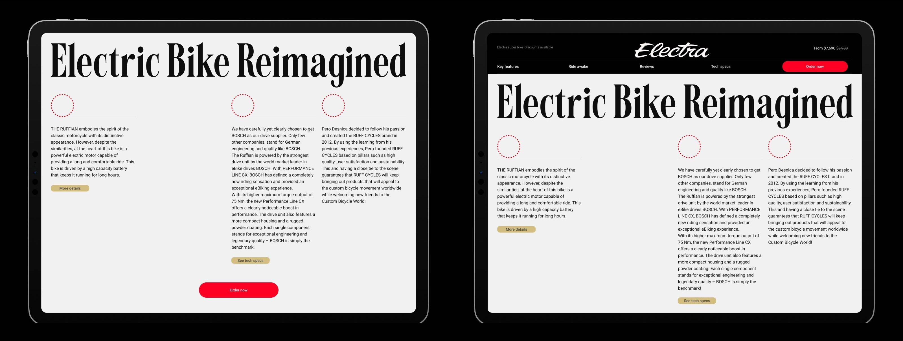
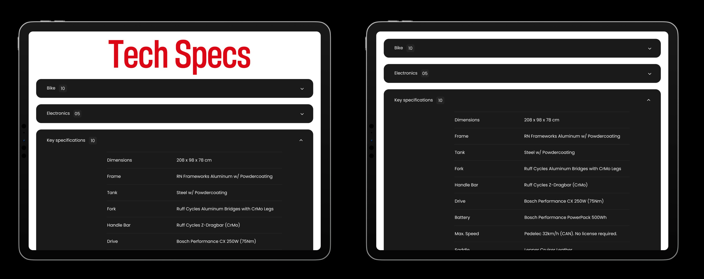
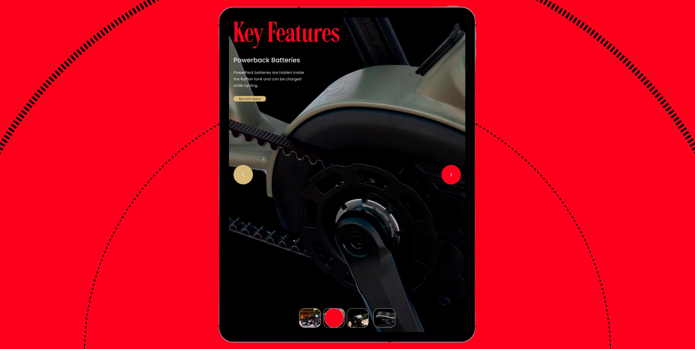
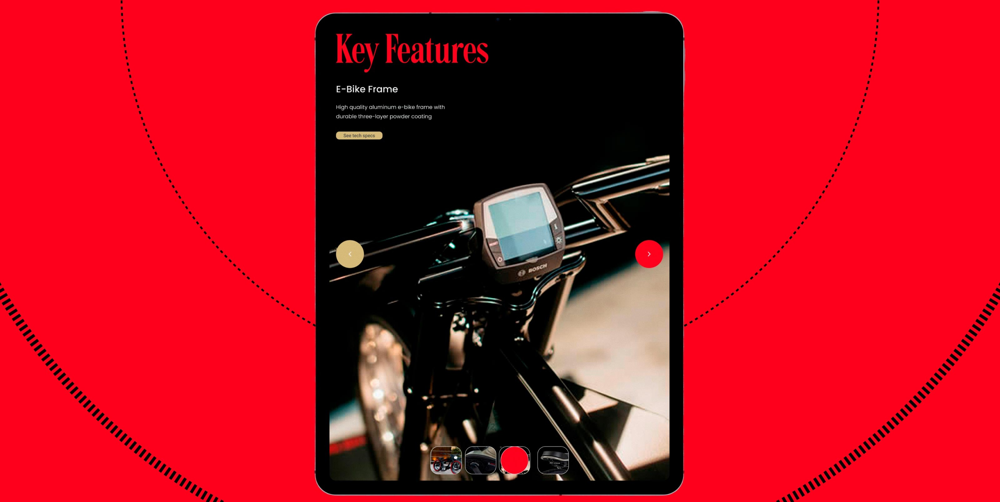

# 🚲 Case Study: Ruffian bikes digital showcase
A premium digital showcase for Ruffian bikes. Focused on luxury branding, cognitive load reduction, and interactive technical data UX for high end e-bikes
## Product Design: Development of a premium interface for e-bikes with a focus on technical data UX.

> **Role:** UX-UI designer. From market analysis and information architecture to visual language and final handoff.

---

## 1. Context and problem
Ruffian bikes is an exclusive product at the intersection of engineering and style. Despite the high cost and uniqueness of the e-bike, the existing interface did not translate the feeling of a "high-end" and quality object.

**My observation:** Technical specifications were presented as a dry list, which did not evoke an emotional response. The design did not match the tactile quality of the product itself, simplifying its perception to a mass-market level and creating a high cognitive load on the buyer.

---

## 2. The task
In this project, I acted as a UX-UI designer. My goal was to create an interface that works on the feeling of premium quality and status. I sought to find a balance between brand image presentation and functionality, turning the study of complex technical data into an aesthetic and intuitive process.

---

## 3. My work process

### Stage 1: Designing visual hierarchy
I started by analyzing the perception of luxury goods. It was important for me to build a user journey so that every scroll confirmed the value of the product. I identified key focus points: the power of the Bosch system, the finishing materials, and the flawlessness of the frame lines.

### Stage 2: Product solution — interactive specifications
The main challenge for me was the presentation of technical characteristics. Ordinary tables look bulky and destroy the premium aesthetic.

**My solution:** I designed a system of smart expanding lists (accordions). 
This allowed the layout to remain "clean": in its idle state, the interface remains light and image-focused. The user chooses the depth of immersion into details (Engine, Battery, Safety) by opening only the necessary blocks.

### Stage 3: Mobile first & accessibility
I paid special attention to the mobile version. Premium design often loses its scale on smartphones, so I looked for a solution that would maintain the brand's status in the user's pocket.

**Implementation:** I implemented a compact system of tabs and expanding elements adapted for thumb control (thumb-friendly). This allowed me to reduce the page length by 3 times, making the study of technical specifications fast and convenient.

---

## 4. Key features: presentation as an art object
I decided to present every detail of the Ruffian as a separate form of art. I developed a "Key Features" section using macro photography: from the electric motor to the seams on the leather seat. The accent typography and the abundance of "air" (white space) that I introduced emphasized the technological superiority of the e-bike.

---

## 5. Product metrics and the profit of my solution
To justify the effectiveness of the design, I based the solution on the following indicators:

* **Reduction of cognitive load:** Thanks to the structure I proposed, the amount of information displayed simultaneously was reduced by half.
* **Optimization of scroll depth:** The use of accordions allowed me to increase the probability of scrolling to the target button (CTA) due to the compactness of the page.
* **Time-to-Content:** The grouping of parameters that I developed reduced the time to find a specific characteristic by an average of 40%.

---

## 6. Summary
I managed to create an interface that does not just inform, but sells a lifestyle. The clarity of the digital lines now fully corresponds to the geometry of Ruffian Bikes. Technical data has become a part of the design, and the mobile version allowed for maintaining premium contact with the brand on any device.

---
[← Back to Portfolio](https://github.com/sazoksis-ux)
